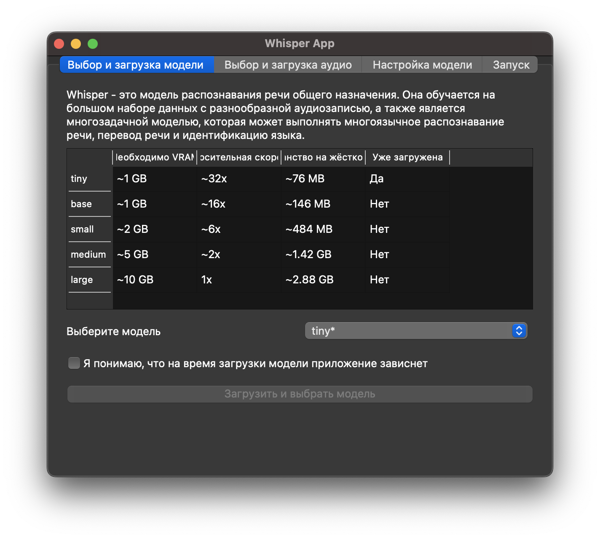
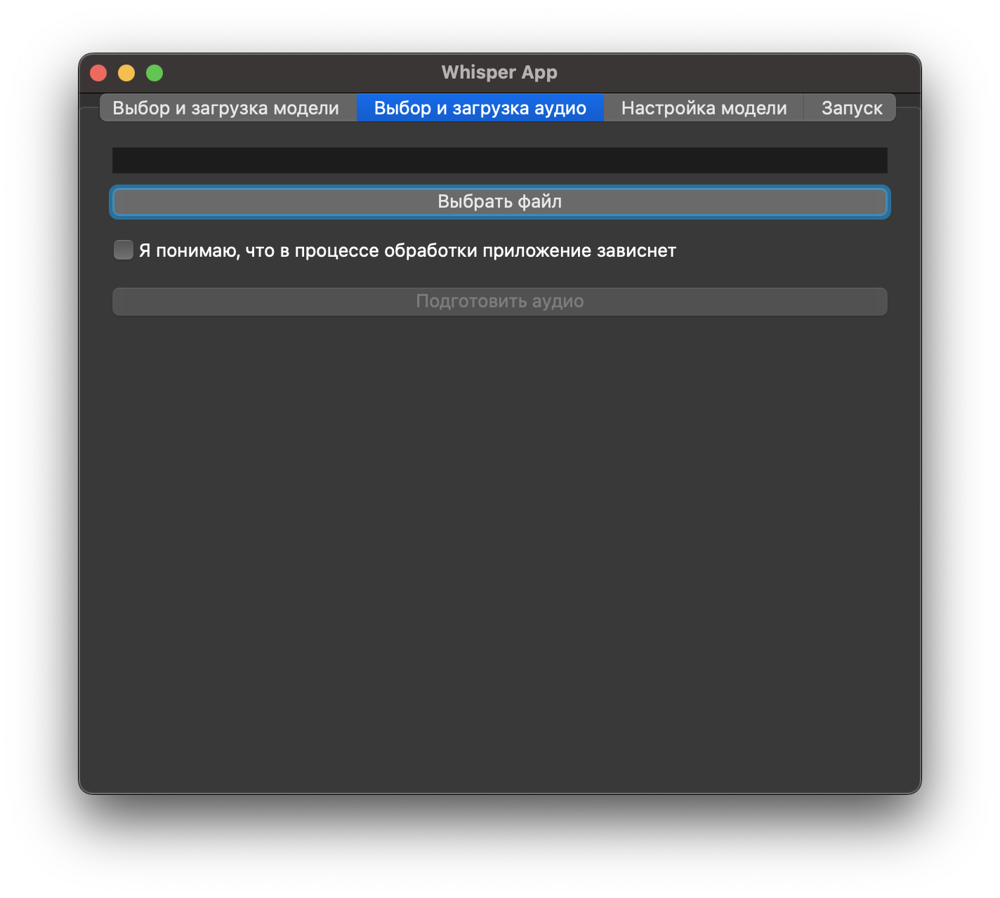
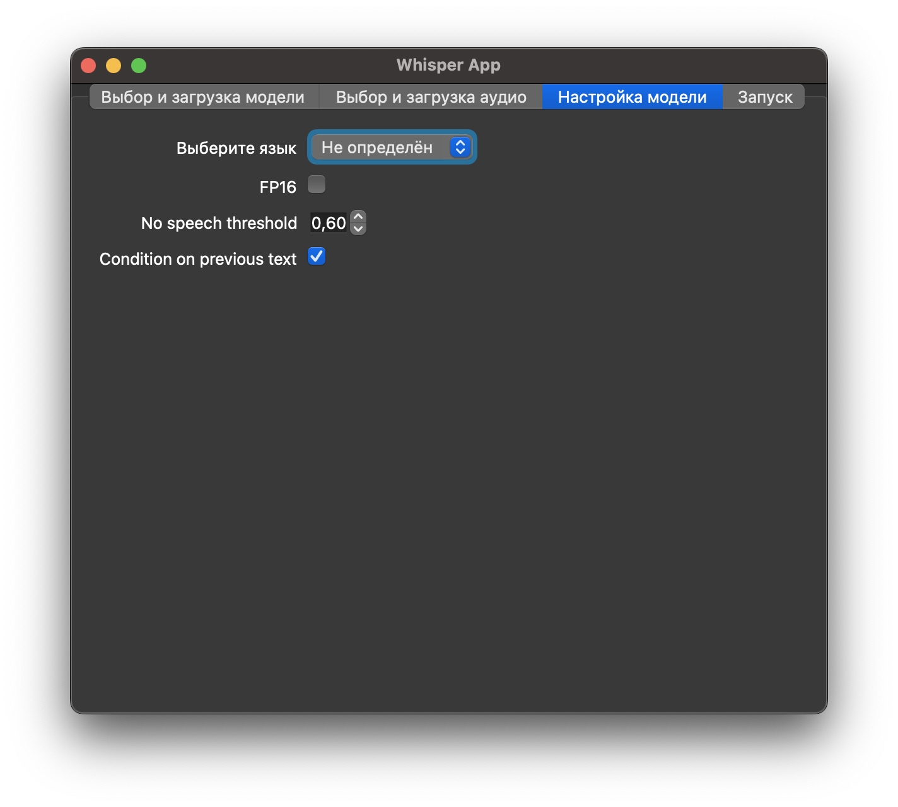
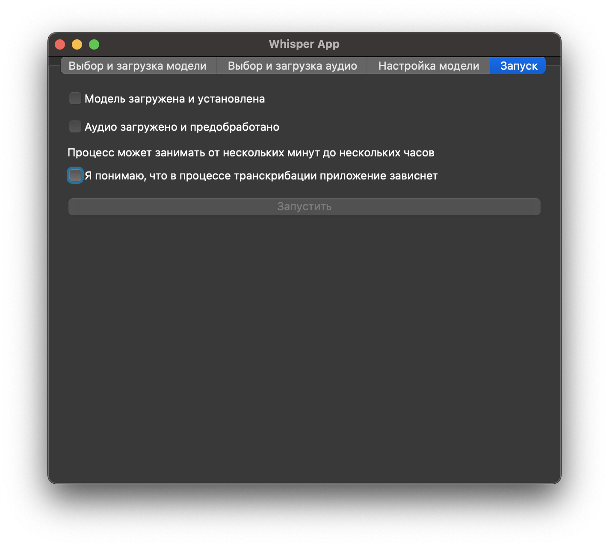

# Whisper App based on Python

Документация к библиотеке Whisper от OpenAI, на которой построены все внутренние процессы: 
[github.com/openai/whisper](https://github.com/openai/whisper/blob/main/README.md)

## Установка 

Для запуска программы необходимо скачать извлекаемый файл и запустить его. На MacOS доступно 
только для архитектуры ARM. 

| Архитектура ПК | Файл для установки                  |
|----------------|-------------------------------------|
| MacOS ARM      | [executable](dist/whisper-arm-arch) |

! После запуска исполняемого файла на MacOS необходимо дождаться, когда исполняемый файл обработается. 
Запуск медленный. 

## Функционал 

В рамках приложения доступна загрузка поддерживаемых [whisper](https://github.com/openai/whisper/blob/main/README.md)
моделей, выбор аудио-файла в формате, поддерживаемом тем же [whisper](https://github.com/openai/whisper/blob/main/README.md)
и настройка некоторых параметров модели. Результат транскрибации сохраняется в три файла: файл-txt со всем текстом, 
файл-txt с текстами сегментов и файл-csv с подробной информацией о сегментах. 

###  Выбор и загрузка модели 

Одну модель достаточно загрузить один раз, после чего она сохраняется в дефолтном для whisper месте: `.cache/whisper`. 

После нажатия на кнопку загрузки и конфигурации модели приложение зависнет до момента, пока модель не будет загружена 
и настроена. Это может длиться до нескольких часов, если на загрузку поставлена самая большая модель. Скорость 
первой загрузки напрямую зависит от скорости интернет-соединения. 

### Выбор аудиофайла 

В окне для выбора файла устанавливается фильтр на поддерживаемые расширения. 

После нажатия кнопки "Подготовить аудио" приложение зависнет до тех пор, пока аудио не будет обработано. Процесс может 
длиться до нескольких часов. Скорость обработки напрямую зависит от размера аудио-файла. 

### Настройка модели 

Описание параметров см. в [официальной документации](https://github.com/openai/whisper/blob/main/whisper/transcribe.py)

### Запуск модели 

Для запуска модели необходимо настроить модель и аудио, а также согласиться с тем, что приложение зависнет на время 
выполнения задачи. Процесс может длиться от нескольких минут до нескольких часов. Скорость зависит от объёма аудиофайла 
и от выбранной модели (более тяжёлые модели работают медленнее, но более точно распознают). 

Результат обработки будет сохранён в той же папке, что и аудиофайл. В этой папке появится новая папка с названием 
`transcription_YYYYMMDDHHMM`, внутри неё - три файла: файл-txt со всем текстом, 
файл-txt с текстами сегментов и файл-csv с подробной информацией о сегментах. 